# PChat

PChat is a modern Flutter-based social communication platform that combines real-time chatting, AI-powered interactions, social networking, and smart utilities into one seamless mobile application.

Built using Flutter and Firebase, PChat delivers a connected social experience with features like real-time messaging, AI voice assistant integration, OCR scanning, Google Maps live location sharing, online/offline activity tracking, push notifications, and interactive social posts.

The application is lightweight, fast, and optimized using GetX State Management for high performance and smooth user experience.

---

# ✨ Features

## 🔐 Authentication

* Email & Password Authentication
* Firebase Authentication Integration
* Secure User Login & Registration

---

## 📝 Social Posting System

Users can:

* Create text posts
* Like posts
* Comment on posts
* Reshare posts
* Interact with community posts in real time
* edit post, comment by the owner

---

## 💬 Real-Time Chat System

* One-to-One Chat
* Real-Time Messaging
* Friend System
* Group Creation & Group Chats
* Firebase Realtime Database Integration

---

## 🟢 Online / Offline Status

PChat uses connectivity services to track user activity in real time.

Features include:

* Real-time online/offline status
* Instant activity updates
* Presence tracking
* Active friend monitoring

---

## 📍 Live Location Sharing

Integrated with Google Maps for real-time location tracking.

Features include:

* Live friend location updates
* Interactive Google Maps integration
* Real-time location sharing
* User location visualization on map

---

## 🔔 Push Notifications

Powered by Firebase Cloud Messaging (FCM).

Features:

* Real-time push notifications
* Message notifications
* Activity alerts
* Background notification handling

---

## 🤖 AI Voice Assistant

Integrated with Hume AI Voice Assistant.

Capabilities:

* Voice-based interaction
* Conversational AI experience
* Smart assistant communication
* AI-powered responses

---

## 📷 Google Lens / OCR Integration

* Scan and extract text from images
* OCR-based text recognition
* Smart text detection using camera input

---

# ⚡ Performance & Architecture

PChat is designed to be:

* Lightweight
* Fast
* Responsive
* Optimized for low memory usage

### State Management

* GetX State Management
* Reactive UI updates
* Efficient dependency injection
* Minimal rebuilds for better performance

---

# 🛠️ Tech Stack

## Frontend

* Flutter
* Dart

## State Management

* GetX

## Backend & Services

* Firebase Authentication
* Firebase Realtime Database
* Firebase Cloud Messaging (FCM)

## APIs & Integrations

* Google Maps API
* Hume AI
* Google ML Kit / OCR
* Connectivity Services

---

# 📱 Platform Support

* Android ✅
* iOS ⚡ (Planned)
* Web ⚡ (Planned)

---

# 📂 Project Structure

```bash id="y3avsa"
lib/
 ├── auth/
 ├── chat/
 ├── groups/
 ├── maps/
 ├── posts/
 ├── services/
 ├── controllers/
 ├── models/
 ├── widgets/
 └── main.dart

```

## 📸 Screenshots

| Splash | Auth |
|------|------|
| 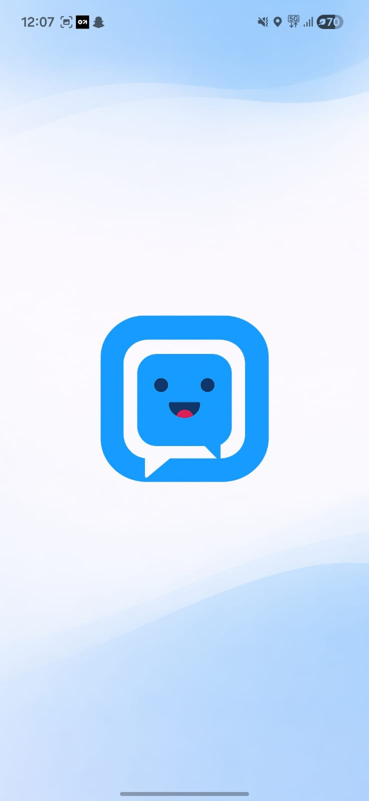 | 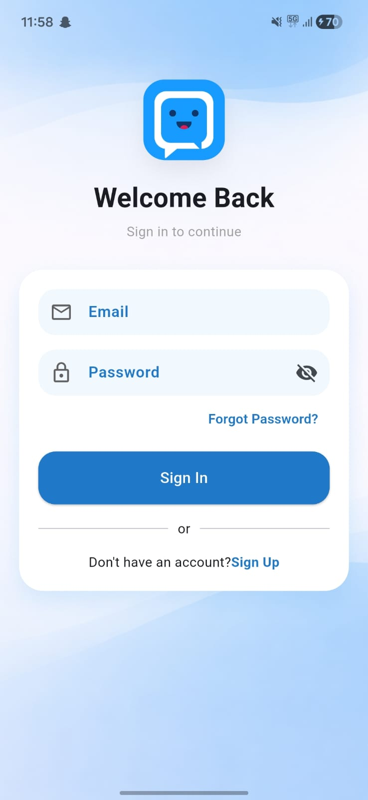 |

| Create Post | Text Scanner |
|------|------|
| 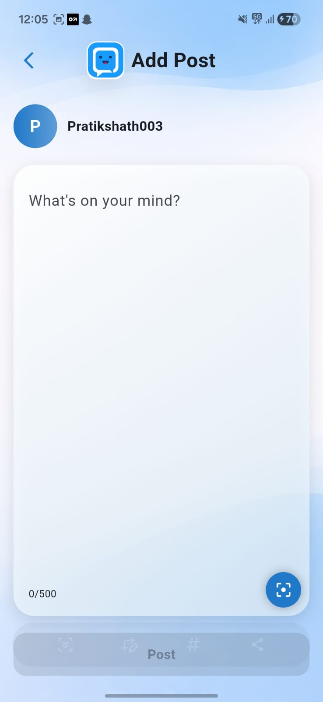 | 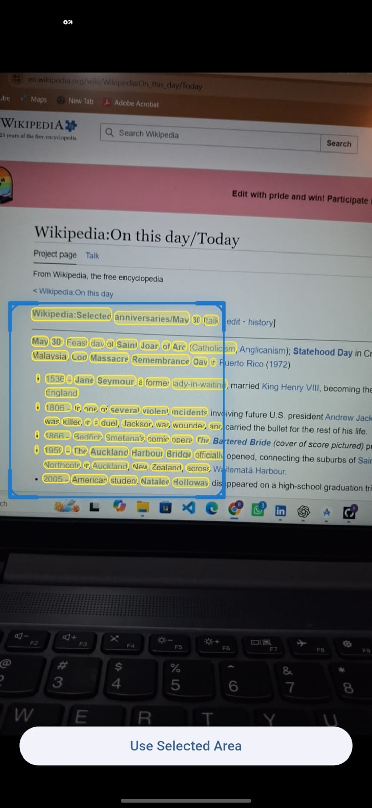 |

|  Post | Feed |
|------|------|
| 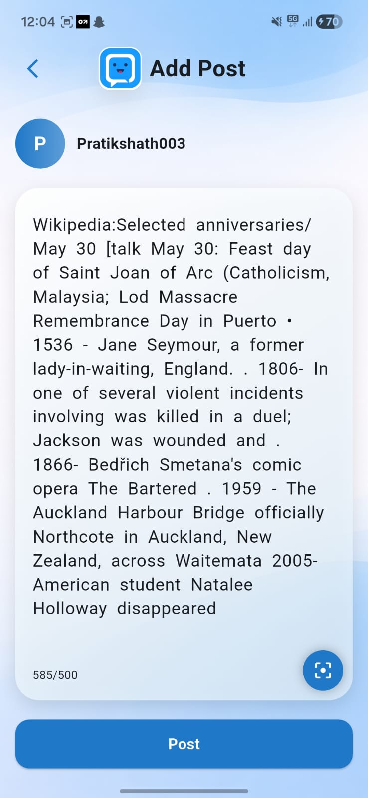 | 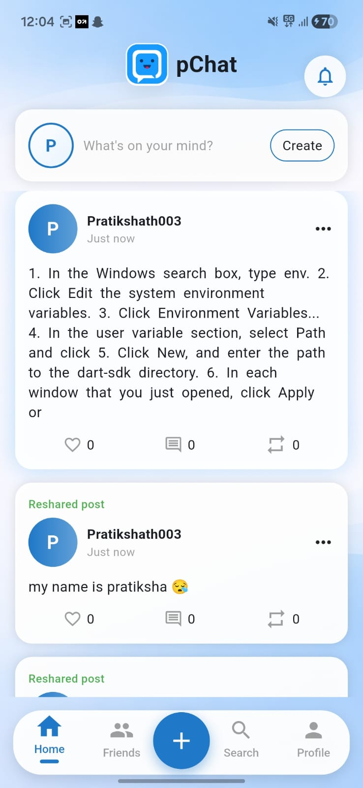 |

| Profile | Edit Profile |
|------|------|
| 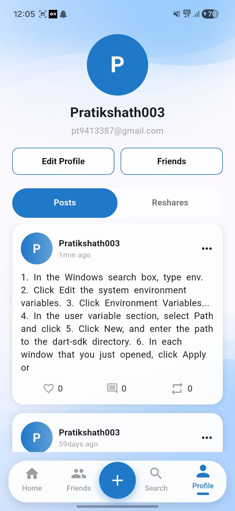 | 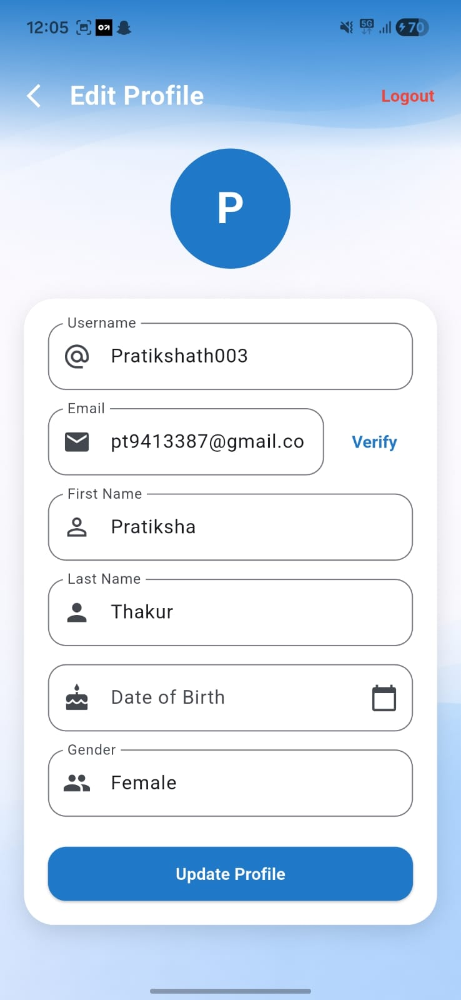 |

| All User | Request Notifications |
|------|------|
| 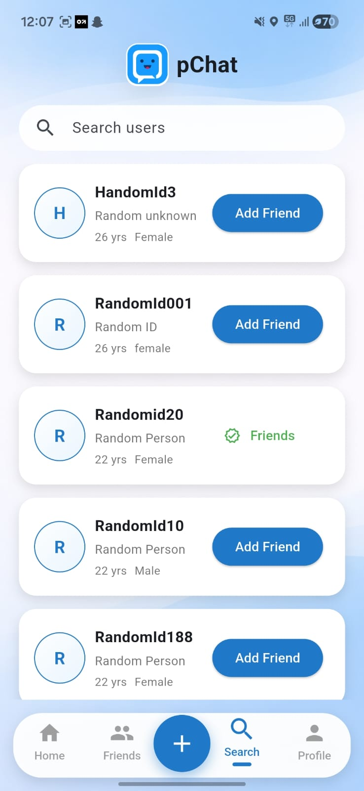 | 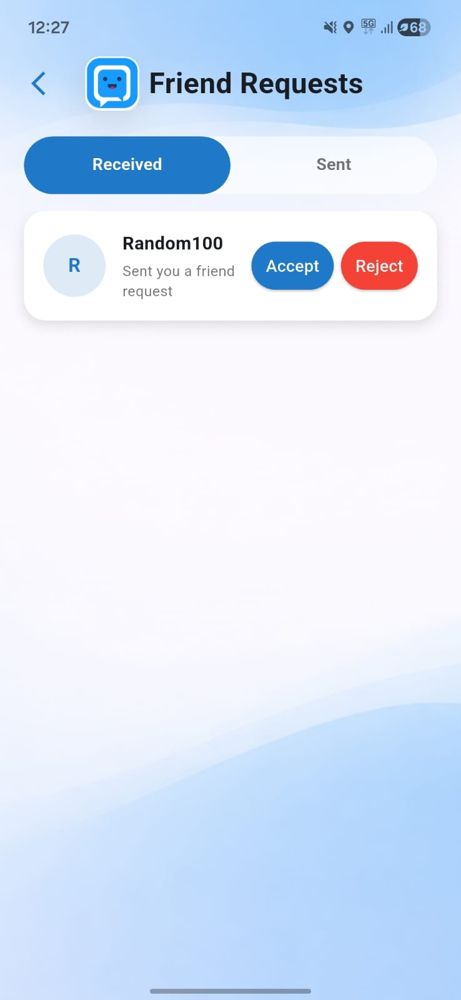 |

| Friend Live Location | Ai voice assistant call |
|------|------|
|  | 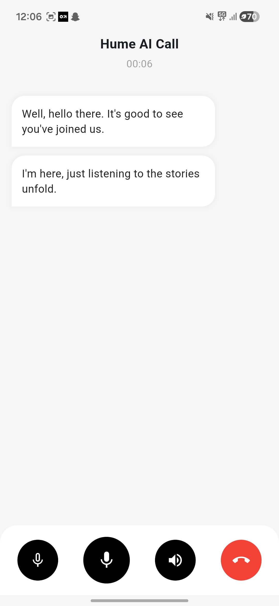 |

---

# 🧠 Future Improvements

* Voice & Video Calling
* AI Chatbot Expansion
* Story/Status Feature
* Dark Mode
* Media Sharing
* End-to-End Encryption
* AI Content Recommendations
* Nearby Friends Discovery

---

## PChat — Smart Social Communication Platform
